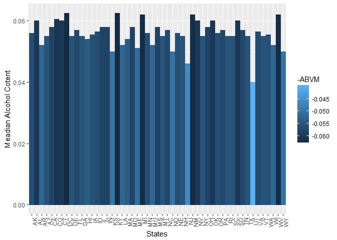

# BeersAndBreweries
Ramya Mandava  
July 2, 2017  


#Introduction
When drinking beer, there are many factors to be considered. Principal among them are bitterness, the variety of flavours present in the beverage, along with their intensity, alcohol content, and colour. Standards for those characteristics allow a more objective and uniform determination to be made on the overall qualities of any beer.(Reference to: https://en.wikipedia.org/wiki/Beer_measurement).  
The purpose of this document is to analyze and find correlations if any, by carefully examining each description of the Beers dataset containing a list of 2410 US craft beers and Breweries dataset containing 558 US
breweries.The datasets descriptions are as follows:

###Beers.csv:
* Name: Name of the beer.
* Beer ID: Unique identifier of the beer.
* ABV: Alcohol by volume of the beer.
* IBU: International Bitterness Units of the beer.
* Brewery ID: Brewery id associated with the beer.
*  Style: Style of the beer.
*Ounces: Ounces of beer.

###Breweries.csv:
* Brew ID: Unique identifier of the brewery.
* Name: Name of the brewery.
* City: City where the brewery is located.
* State: State where the brewery is located.


```r
#Setup

#Loading libraries
library(repmis)
library(dplyr)
```

```
## 
## Attaching package: 'dplyr'
```

```
## The following objects are masked from 'package:stats':
## 
##     filter, lag
```

```
## The following objects are masked from 'package:base':
## 
##     intersect, setdiff, setequal, union
```

```r
library(ggplot2)

#Set working Directory
setwd("C:/Users/aura7/Documents/SMU/Courses/Summer1/DoingDS_MSDS6306/Week7/CaseStudy_01/SMUCaseStudy01")

#Gather Beer and Breweries Datfiles
source("Analysis/Data/GatherBeerData.R")
```

```
## Downloading data from: https://raw.githubusercontent.com/RMandava6/DataRepo/master/Beers_2_2.csv
```

```
## Specified SHA-1 hash matches downloaded data file.
```

```r
source("Analysis/Data/GatherBreweriesData.R")
```

```
## Downloading data from: https://raw.githubusercontent.com/RMandava6/DataRepo/master/Breweries_2_2.csv 
## 
## Specified SHA-1 hash matches downloaded data file.
```

#Analysis
Examining the Breweries dataset, it has been found that, Colorado state has the most number of Breweries(47), followed by California(39) and Michigan(32). More than 50% of the US states have less than 10 breweries.


```r
# Counts the number of Breweries present in each State and prints the data frame
source("Analysis/Data/BreweriesCount01.R")
print(tbl_df(BrewerieCount), n=51)
```

```
## # A tibble: 51 x 2
##    State     n
##    <chr> <int>
##  1    AK     7
##  2    AL     3
##  3    AR     2
##  4    AZ    11
##  5    CA    39
##  6    CO    47
##  7    CT     8
##  8    DC     1
##  9    DE     2
## 10    FL    15
## 11    GA     7
## 12    HI     4
## 13    IA     5
## 14    ID     5
## 15    IL    18
## 16    IN    22
## 17    KS     3
## 18    KY     4
## 19    LA     5
## 20    MA    23
## 21    MD     7
## 22    ME     9
## 23    MI    32
## 24    MN    12
## 25    MO     9
## 26    MS     2
## 27    MT     9
## 28    NC    19
## 29    ND     1
## 30    NE     5
## 31    NH     3
## 32    NJ     3
## 33    NM     4
## 34    NV     2
## 35    NY    16
## 36    OH    15
## 37    OK     6
## 38    OR    29
## 39    PA    25
## 40    RI     5
## 41    SC     4
## 42    SD     1
## 43    TN     3
## 44    TX    28
## 45    UT     4
## 46    VA    16
## 47    VT    10
## 48    WA    23
## 49    WI    20
## 50    WV     1
## 51    WY     4
```

###Merging
Beers and Breweries data has been cleaned and merged for further analysis. First and last 6 rows of the merged data are being printed as shown below to make sure merging is done well.Merged data is then copied to a Data folder incase of future need.


```r
source("Analysis/Data/MergingBeer_Breweries.R")
head(MergedData1)
```

```
##   Brewery_id          Beer Beer_ID   ABV IBU
## 1          1  Get Together    2692 0.045  50
## 2          1 Maggie's Leap    2691 0.049  26
## 3          1    Wall's End    2690 0.048  19
## 4          1       Pumpion    2689 0.060  38
## 5          1    Stronghold    2688 0.060  25
## 6          1   Parapet ESB    2687 0.056  47
##                                 Style Ounces           Brewery        City
## 1                        American IPA     16 NorthGate Brewing Minneapolis
## 2                  Milk / Sweet Stout     16 NorthGate Brewing Minneapolis
## 3                   English Brown Ale     16 NorthGate Brewing Minneapolis
## 4                         Pumpkin Ale     16 NorthGate Brewing Minneapolis
## 5                     American Porter     16 NorthGate Brewing Minneapolis
## 6 Extra Special / Strong Bitter (ESB)     16 NorthGate Brewing Minneapolis
##   State
## 1    MN
## 2    MN
## 3    MN
## 4    MN
## 5    MN
## 6    MN
```

```r
tail(MergedData1)
```

```
##      Brewery_id                      Beer Beer_ID   ABV IBU
## 2405        556             Pilsner Ukiah      98 0.055  NA
## 2406        557  Heinnieweisse Weissebier      52 0.049  NA
## 2407        557           Snapperhead IPA      51 0.068  NA
## 2408        557         Moo Thunder Stout      50 0.049  NA
## 2409        557         Porkslap Pale Ale      49 0.043  NA
## 2410        558 Urban Wilderness Pale Ale      30 0.049  NA
##                        Style Ounces                       Brewery
## 2405         German Pilsener     12         Ukiah Brewing Company
## 2406              Hefeweizen     12       Butternuts Beer and Ale
## 2407            American IPA     12       Butternuts Beer and Ale
## 2408      Milk / Sweet Stout     12       Butternuts Beer and Ale
## 2409 American Pale Ale (APA)     12       Butternuts Beer and Ale
## 2410        English Pale Ale     12 Sleeping Lady Brewing Company
##               City State
## 2405         Ukiah    CA
## 2406 Garrattsville    NY
## 2407 Garrattsville    NY
## 2408 Garrattsville    NY
## 2409 Garrattsville    NY
## 2410     Anchorage    AK
```

###Checking for NA's
Looking for NA items and Blank spaces is extremely important in data analysis as it might lead to innacurate results. Close examination of the merged dataset showed that there are 62 entries of NA for ABV(Variable describing Alcohol content in Beer), 1005 entries of NA for IBU(Internationally recognized bitterness units of beer) and 5 blank entries for Style.


```r
source("Analysis/ReportingNAs.R")
```

```
## Below is the data frame showing NA counts for each variable
```

```r
na_count
```

```
## Brewery_id       Beer    Beer_ID        ABV        IBU      Style 
##          0          0          0         62       1005          5 
##     Ounces    Brewery       City      State 
##          0          0          0          0
```


###Median Alcohol Content and Median Bitterness units by State
The below graph on median alcohol content in Beers by state shows that, majority of the states are brewing beers with a median alcoholic content > 5%, which falls under the higher limit of alcoholic percentage for beers (Reference to: https://en.wikipedia.org/wiki/Unit_of_alcohol). Washington DC, Kentucky, Michigan, New Mexico and West Virginia states have beers with ABV exceeding 6%.


```r
source("Analysis/BarPlot.R", echo = TRUE)
```

```
## 
## > ABVM <- MergedData2$ABV
## 
## > IBUM <- MergedData2$IBU
## 
## > StateM <- MergedData2$State
## 
## > ABVMedian <- aggregate(ABVM ~ StateM, FUN = median)
## 
## > IBUMedian <- aggregate(IBUM ~ StateM, FUN = median)
## 
## > ABV_BarPlot <- ggplot(ABVMedian, aes(ABVMedian$StateM, 
## +     ABVMedian$ABVM, fill = -ABVM, colour = -ABVM, label = "Median Alcohol Content")) + 
## +  .... [TRUNCATED] 
## 
## > ABV_BarPlot
```

<!-- -->

```
## 
## > IBU_BarPlot <- ggplot(IBUMedian, aes(IBUMedian$StateM, 
## +     IBUMedian$IBUM, fill = -IBUM, colour = -IBUM)) + geom_bar(stat = "identity") + 
## +      .... [TRUNCATED] 
## 
## > IBU_BarPlot
```

<!-- -->

The International Bittering Units scale, or simply IBU scale, is used to approximately quantify the bitterness of beer. The European Bitterness Units scale, often abbreviated as EBU, is a bitterness scale[20] in which lower values are generally "less bitter" and higher values "more bitter". The scale and method are defined by the European Brewery Convention, and the numerical value should be the same as of the International Bittering Units scale (IBU), defined in co-operation with the American Society of Brewing Chemists.(Reference to: https://en.wikipedia.org/wiki/Beer_measurement).  
The above graph on median IBU(Bitterness units) of beers by state shows that, Maine and West Virginia sates are making the most bitter beer based on median valuee, followed by Denver, Gerogia and Florida with median IBU > 50.  
> West Virginia state, seems to be common between higher ABV and higher IBU data. Which leads to the question if there is a relationship between alcohol levels and bitterness of beer.

###States with Max IBU and Max ABV
Running analysis on the merged data, it has been noticed that the state with most bitter beer is Oregon, while the state with maximum alcoholic beer is Colorado. However, this does not provide much information on the relationship between ABV and IBU


```r
source("Analysis/MaxIBU_ABV.R", echo = TRUE)
```

```
## 
## > x <- MergedData2
## 
## > ABV_Max_state <- x[which.max(x[, 4]), 10]
## 
## > cat("State with maximum alcoholic Beer is:", ABV_Max_state)
## State with maximum alcoholic Beer is: CO
## > IBU_Max_state <- x[which.max(x[, 5]), 10]
## 
## > cat("State with the most bitter Beer is:", IBU_Max_state)
## State with the most bitter Beer is: OR
```

###Summary stats for ABV(Alcohol content)
Running summary statistics for ABV showed that more than 50% of the beers have alcoholic content greater than 5.5% which is the higher limit of alcoholic percentage for beers(Reference to:https://en.wikipedia.org/wiki/Unit_of_alcohol).

```r
source("Analysis/SummaryABV.R", echo = TRUE)
```

```
## 
## > cat("Summary Stats for ABV")
## Summary Stats for ABV
## > summary(MergedData2$ABV)
##    Min. 1st Qu.  Median    Mean 3rd Qu.    Max.    NA's 
## 0.00100 0.05000 0.05600 0.05977 0.06700 0.12800      62
```

###Scatterplot ABV vs IBU


```r
source("Analysis/ScatterPlotABV_IBU.R", echo = TRUE)
```

```
## 
## > attach(MergedData2)
## 
## > Scatter_Plot <- plot(ABV, IBU, main = "Alcohol content vs. International Bitterness Unit", 
## +     xlab = "Alcohol Content by Volume", ylab = "Intern ..." ... [TRUNCATED]
```

<!-- -->

```
## 
## > detach(MergedData2)
```

#Conclusion
Looking at the scattered plot on Alcohol content vs Bitterness of the beer, there seems to be a strong positive correlation between the two. Bitterness of the beer is increased with increase in alcohol content. Especially beers with Alcoholic content crossing 0.06 has a big increase in bitterness.
